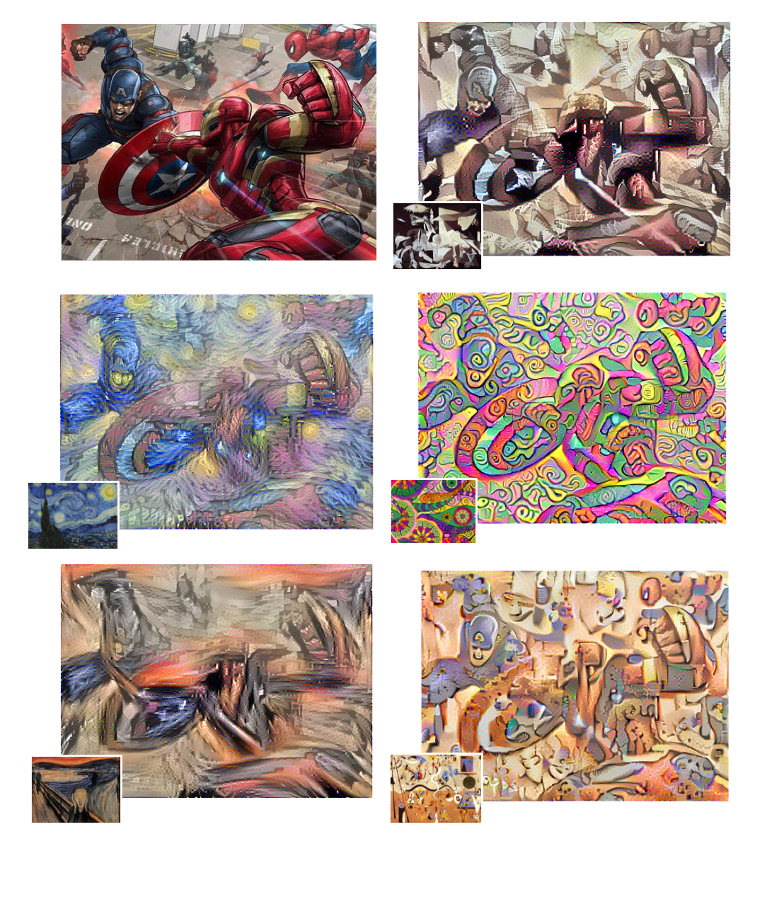

# 🎨 ArtMorphAI
### *Transform your photos into artistic masterpieces using deep learning and neural style transfer*



**ArtMorphAI** is a neural style transfer project that combines the content of one image with the artistic style of another, using convolutional neural networks and perceptual loss. Built using TensorFlow and based on the paper [A Neural Algorithm of Artistic Style](https://arxiv.org/abs/1508.06576), this project brings the magic of AI-generated art to life.

---

## 📌 Table of Contents
- [🚀 Features](#-features)
- [🧠 How It Works](#-how-it-works)
- [🛠️ Requirements](#-requirements)
- [📂 Project Structure](#-project-structure)
- [▶️ Usage](#-usage)
- [📸 Style Transfer Examples](#-style-transfer-examples)
- [📚 References](#-references)

---

## 🚀 Features

- ⚡ Real-time neural style transfer on images
- 🖼️ Supports custom content and style image input
- 📊 Optimized using content loss and style loss with VGG-19
- 💻 Lightweight TensorFlow 1.x implementation
- 🖌️ Output results with high visual fidelity

---

## 🧠 How It Works

ArtMorphAI uses a pre-trained **VGG-19 network** to extract:
- **Content features** from the content image
- **Style features** from the style image using Gram matrices

Then it generates a new image by minimizing a **combined perceptual loss**:

Total Loss = α * Content Loss + β * Style Loss

The output image learns to preserve the structure of the content image while reflecting the artistic style of the style image.

---

## 🛠️ Requirements

- Python 3.6
- TensorFlow 1.6
- NumPy
- Matplotlib
- Pillow

### ✅ Install Dependencies
```bash
pip install tensorflow==1.6 numpy matplotlib pillow

